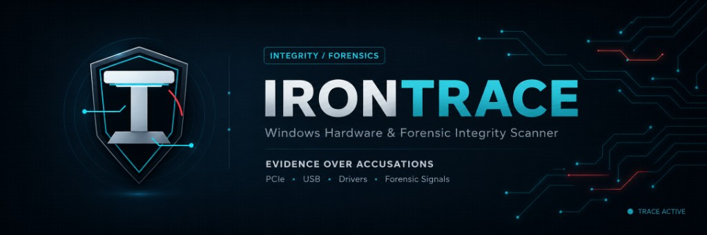

<p align="center">
  
</p>

# IronTrace

<p align="center">
  <a href="https://github.com/codedevdev/irontrace/actions/workflows/ci.yml"></a>
  <a href="https://github.com/codedevdev/irontrace/actions/workflows/release.yml"></a>
  <a href="https://github.com/codedevdev/irontrace/releases/latest"></a>
  <a href="https://github.com/codedevdev/irontrace/releases"></a>
  <a href="https://dotnet.microsoft.com/"></a>
  <a href="https://github.com/codedevdev/irontrace"></a>
  <a href="../../LICENSE"></a>
</p>

<p align="center">
  <strong>🌐 Języki / Languages</strong><br/>
  <a href="../../README.md">English</a> ·
  <a href="README.uk.md">Українська</a> ·
  <a href="README.de.md">Deutsch</a> ·
  <a href="README.fr.md">Français</a> ·
  <a href="README.es.md">Español</a> ·
  <b>Polski</b> ·
  <a href="README.pt.md">Português</a> ·
  <a href="README.zh-CN.md">中文</a> ·
  <a href="README.ja.md">日本語</a>
</p>

**Skaner integralności sprzętu i forensic dla Windows — dla administratorów serwerów gier.**

IronTrace zbiera dowody dotyczące bezpieczeństwa platformy, urządzeń PCI/PCIe/USB, sterowników oraz opcjonalnych sygnałów forensic — a następnie tworzy zrozumiałą ocenę integralności. Pomaga **przejrzeć** maszynę. Nie oznacza kogoś za cheatera na podstawie jednego podejrzanego wyniku. Nie ma ścieżki automatycznego bana.

| Kanał | Wersja |
|-------|--------|
| Aplikacja | **0.7.0** (Faza 6 — Forensic Integrity Scan) |
| Schemat raportu | `1.6` |
| API | `v1` |
| Protokół sterownika | `2` |
| Schemat bazy referencyjnej | `2` |

---

## Spis treści

- [Szybki start](#szybki-start)
- [Tryby skanowania](#tryby-skanowania)
- [Aplikacja desktopowa (WPF)](#aplikacja-desktopowa-wpf)
- [CLI](#cli)
- [Opcjonalne skanowanie pamięci (hollows_hunter)](#opcjonalne-skanowanie-pamięci-hollows_hunter)
- [Wysyłanie na serwer i przegląd admina](#wysyłanie-na-serwer-i-przegląd-admina)
- [Co robi](#co-robi)
- [Czym nie jest](#czym-nie-jest)
- [Architektura](#architektura)
- [Rozwój](#rozwój)
- [Uwagi dotyczące komponentów zewnętrznych](#uwagi-dotyczące-komponentów-zewnętrznych)
- [Dokumentacja](#dokumentacja)
- [Licencja i kontakt](#licencja-i-kontakt)

---

## Szybki start

**Użytkownik końcowy (opublikowana build lub `dotnet run`):**

1. Uruchom IronTrace na Windows 10/11 x64.
2. Wybierz tryb skanowania na ekranie głównym:
   - **Admin Scan** — sprzęt + opcjonalna głęboka analiza forensic dla adminów serwera.
   - **Self-Audit** — skan dla gracza; automatycznie zapisuje raport HTML na pulpicie.
3. Przejrzyj werdykt i wyniki na ekranie Result.
4. Eksportuj JSON, wyślij na serwer IronTrace lub rozpocznij nowy skan.

**Deweloper:**

```powershell
git clone <repo-url> dma-guard
cd dma-guard
dotnet restore IronTrace.sln
dotnet build IronTrace.sln -c Release
dotnet test IronTrace.sln -c Release
dotnet run --project src/IronTrace.App -c Release
```

Skany działają **offline**, gdy w `data/reference/` są dołączone bazy referencyjne. Podniesienie uprawnień jest opcjonalne (`asInvoker`); uruchom jako Administrator tylko wtedy, gdy potrzebujesz szczegółów Code Integrity / DeviceGuard.

---

## Tryby skanowania

IronTrace rozdziela skany **tylko sprzętowe** od profili **forensic**. Warstwy forensic wymagają zgody na prywatność; skan pamięci wymaga jawnej opt-in i zewnętrznych narzędzi (patrz poniżej).

| Tryb | Przycisk WPF | CLI `--profile` | Warstwy forensic | Typowe użycie |
|------|--------------|-----------------|------------------|---------------|
| Tylko sprzęt | Admin Scan (bez checkboxów forensic) | `hardware-only` | Brak | Bazowa integralność PCI/USB/sterowników |
| Pełny forensic | Admin Scan + checkboxy procesów / pamięci | `full-forensic` | Wszystkie (pamięć, jeśli narzędzie zainstalowane + `--memory`) | Głęboka analiza admina |
| Self-audit | **Self-Audit** | `self-audit` | Execution, BYOVD, HWID, overlay, inwentarz procesów | Raport przejrzystości dla gracza |
| Console rig | — | `console-rig` | Self-audit + karta przechwytywania / wejście | Drugi PC w setupie streamingu |

**Warstwy forensic (Faza 6):**

| Warstwa | Co sprawdza | Zgoda |
|---------|-------------|-------|
| 0 | Prefetch/BAM/ShimCache, BYOVD deep, HWID cross-source, overlays | Włączone dla Self-Audit / Full Forensic |
| 1 | Inwentarz procesów/usług, persistence (zadania, klucze Run) | Checkbox `IncludeProcessInventory` lub domyślne ustawienie profilu |
| 2 | Integralność pamięci przez subprocess **hollows_hunter** | Checkbox `IncludeMemoryScan` lub CLI `--memory` |

Bez zainstalowanego hollows_hunter warstwa 2 jest pomijana — reszta nadal działa. UI pokazuje powiadomienie, gdy narzędzie jest brak.

---

## Aplikacja desktopowa (WPF)

```powershell
dotnet run --project src/IronTrace.App -c Release
```

### Ekran główny

| Element | Cel |
|---------|-----|
| **Admin Scan** | Skan sprzętu; staje się Full Forensic, gdy zaznaczone są checkboxy procesów lub pamięci |
| **Self-Audit** | Profil forensic self-audit; zapisuje HTML do `%USERPROFILE%\Desktop\` |
| Include process/service inventory | Warstwa 1 — listuje uruchomione procesy i usługi (opt-in prywatności) |
| Include memory scan via PE-sieve | Warstwa 2 — włączone tylko gdy zainstalowany jest [hollows_hunter](#opcjonalne-skanowanie-pamięci-hollows_hunter) |
| Include PnP device history | Opt-in prywatności; koreluje historyczne wpisy PCI z watchlistą |

### Ekran Result

- **Verdict** — wynik konserwatywnego silnika ryzyka (`Normal` … `HighRisk`, nigdy auto-ban).
- **Forensic banner** — wysokopoziomowe podsumowanie forensic, gdy dotyczy.
- **Export report** — JSON z przełącznikami prywatności (domyślnie hash serialu, nie surowy serial).
- **Upload to server** — challenge/nonce + HMAC do Twojej instancji IronTrace.
- **Browse devices / Findings** — szczegóły PCI/USB i poszczególnych wyników.

---

## CLI

Skany bez interfejsu graficznego — automatyzacja, CI lub skrypty admina:

```powershell
dotnet run --project src/IronTrace.Cli -c Release -- scan --profile self-audit --output report.json
```

```powershell
# Full forensic + memory (wymaga hollows_hunter w artifacts/tools/)
dotnet run --project src/IronTrace.Cli -c Release -- scan --profile full-forensic --memory --output report.json

# Tylko bazowy sprzęt
dotnet run --project src/IronTrace.Cli -c Release -- scan --profile hardware-only --output report.json
```

| Flag | Opis |
|------|------|
| `--profile` | `hardware-only` · `full-forensic` · `self-audit` · `console-rig` |
| `--output` | Ścieżka raportu JSON (domyślnie: plik z timestampem w cwd) |
| `--html` | Opcjonalna ścieżka HTML (Self-Audit automatycznie generuje `.html` obok JSON) |
| `--memory` | Włącza skan pamięci warstwy 2 (tylko full-forensic) |

Opublikowana nazwa binarki: `irontrace.exe` (z publish `IronTrace.Cli`).

---

## Opcjonalne skanowanie pamięci (hollows_hunter)

IronTrace **nie dołącza** narzędzi skanowania pamięci. Po opt-in uruchamia [hollows_hunter](https://github.com/hasherezade/hollows_hunter) jako zewnętrzny subprocess i parsuje stdout JSON. Brak API pamięci w procesie; brak dumpów pamięci w raportach.

| Komponent | Licencja | Dołączony do IronTrace? |
|-----------|----------|-------------------------|
| [hollows_hunter](https://github.com/hasherezade/hollows_hunter) | BSD-2-Clause | **Nie** |
| [pe-sieve](https://github.com/hasherezade/pe-sieve) (`pe-sieve64.dll`) | BSD-2-Clause | **Nie** |

### Instalacja (jednorazowo, admin/lab)

1. Pobierz 64-bitowe buildy Windows z upstream releases.
2. Umieść pliki w ścieżce dev repozytorium:

   ```text
   artifacts/tools/hollows_hunter64.exe
   artifacts/tools/pe-sieve64.dll
   ```

   Dla opublikowanej aplikacji użyj folderu `tools/` obok pliku wykonywalnego.

3. Uruchom ponownie IronTrace — żółty baner **"Memory scan tool not found"** na ekranie głównym powinien zniknąć i checkbox pamięci stanie się aktywny.

Jeśli redistribuujesz hollows_hunter/pe-sieve w swoim pakiecie admina, zachowaj upstream BSD-2-Clause notices. Zobacz [THIRD_PARTY_NOTICES.md](../../THIRD_PARTY_NOTICES.md) i [docs/research/pe-sieve-hollows-hunter.md](../research/pe-sieve-hollows-hunter.md).

---

## Wysyłanie na serwer i przegląd admina

Uruchom serwer lokalnie:

```powershell
dotnet run --project src/IronTrace.Server -c Release
# → http://localhost:5188/admin
```

Z PostgreSQL:

```powershell
docker compose up -d
dotnet run --project src/IronTrace.Server -c Release
```

Przepływ uploadu: klient żąda challenge → podpisuje raport HMAC → serwer zapisuje skan → admin triaguje w `/admin` (Pending / Accepted / Rejected / NeedsInfo). Bootstrap API keys i plain HTTP w dev są tylko do pracy lokalnej — rotuj klucze i używaj HTTPS przed produkcją. Szczegóły: [docs/api/README.md](../api/README.md).

---

## Co robi

- Odczytuje build OS i bezpieczeństwo platformy: Secure Boot, TPM, VBS, HVCI, Kernel DMA Protection, flagi hypervisora
- Inwentaryzuje identyfikację płyty głównej/BIOS, urządzenia PCI/PCIe i USB
- Rozpoznaje nazwy vendor/device z offline baz `pci.ids` / `usb.ids`
- Listuje sterowniki i dopasowuje do offline snapshotu LOLDrivers (dowody BYOVD-style, nie sam werdykt)
- Snapshot logu Code Integrity Operational (więcej szczegółów przy podniesionych uprawnieniach)
- Opcjonalne dowody PCI z kernela przez `IronTrace.Driver` (lab test-signed; degraduje się czysto bez sterownika)
- Bezpieczna polityka challenge (domyślnie deny; bez resetu urządzenia) i wykrywanie PCIe DOE, gdy dostępne są capabilities
- Best-effort snapshot Measured Boot PCR przez TBS (tylko dowód, nie attestation)
- Konserwatywny silnik ryzyka → raport JSON w wersji (schema 1.6) z przełącznikami prywatności eksportu
- DMA watchlist, multi-signal `DMA_SIGNAL_CLUSTER`, opcjonalna historia PnP
- Faza 6 forensic: artefakty wykonania, inwentarz procesów, BYOVD deep, HWID cross-source, sygnały overlay/AI-vision
- Opcjonalny upload na Twój serwer IronTrace do ludzkiego przeglądu admina

---

## Czym nie jest

- **Nie jest kryptograficznym dowodem.** User-mode PCI/USB ID można spoofować; dowody z kernela zwiększają pewność, ale nie potwierdzają uczciwości. Zobacz [threat model](../security/THREAT_MODEL.md).
- **Nie jest spyware.** Brak historii przeglądarki, dokumentów, haseł, keystrokes, screenshotów ani arbitralnych dumpów pamięci procesów.
- **Nie jest toolkitiem DMA.** Opcjonalny sterownik KMDF wykonuje tylko ograniczone IOCTL PCI evidence ([driver boundary](../architecture/DRIVER_BOUNDARY.md)).
- **Nie jest dostawcą cheat tools.** PCILeech, BYOVD exploit kits i HWID spoofers są tylko do research pod `docs/research/`.

---

## Architektura

```text
WPF / CLI
  → Windows + Hardware collectors
  → optional KernelEvidence / MeasuredBoot
  → optional Forensic pipeline (Phase 6)
  → SafeChallengePolicy + DoeSpdmDetector
  → local reference DBs (pci.ids, usb.ids, LOLDrivers)
  → RiskEngine → JSON report (schema 1.6)
  → optional Upload (challenge + HMAC) → Server /admin
```

`IronTrace.Driver` jest budowany z Visual Studio + WDK (nie `dotnet`). CI uruchamia tylko testy usermode.

**Układ solution:**

| Ścieżka | Rola |
|---------|------|
| `src/IronTrace.App` | Klient desktopowy WPF |
| `src/IronTrace.Cli` | Headless scanner |
| `src/IronTrace.Server` | Upload API + admin UI |
| `src/IronTrace.Core` | Orkiestracja skanów |
| `src/IronTrace.Forensics` | Collectory Fazy 6 |
| `src/IronTrace.Hardware` / `IronTrace.Windows` | Collectory platformy i urządzeń |
| `src/IronTrace.RiskEngine` | Findings i werdykt |
| `data/reference/` | Offline bazy pci/usb/loldrivers |
| `artifacts/tools/` | Opcjonalny hollows_hunter (nie w git) |

---

## Rozwój

### Wymagania

- Windows 10/11 x64
- [.NET 10 SDK](https://dotnet.microsoft.com/download) (`global.json` przypina wersję)
- Docker (opcjonalnie) — PostgreSQL dla lokalnego stacku serwera
- Visual Studio + WDK (opcjonalnie) — tylko dla `IronTrace.Driver`

### Build i testy

```powershell
dotnet restore IronTrace.sln
dotnet build IronTrace.sln -c Release
dotnet test IronTrace.sln -c Release
```

### Publish (self-contained win-x64)

```powershell
dotnet publish src/IronTrace.App -c Release -r win-x64 --self-contained true -p:PublishSingleFile=true -o artifacts/publish/win-x64
```

Maszyny użytkownika końcowego nie potrzebują runtime .NET przy self-contained publish.

### Baza referencyjna

Dołączone bazy w `data/reference/` utrzymują skany offline. Przebuduj importerem:

```powershell
dotnet run --project tools/HardwareDbImporter -- --mode pci --input path\to\pci.ids --output data/reference/pci-reference.db
dotnet run --project tools/HardwareDbImporter -- --mode usb --input path\to\usb.ids --output data/reference/usb-reference.db
dotnet run --project tools/HardwareDbImporter -- --mode loldrivers --input path\to\loldrivers --output data/reference/loldrivers-reference.db
```

Obsługuje też `gen-keys` / `sign-manifest` dla podpisanych pakietów aktualizacji referencji. Zobacz [docs/database/REFERENCE_DB.md](../database/REFERENCE_DB.md).

### Zasady projektowe

- Dowody zamiast oskarżeń · unsupported nie jest suspicious
- Brak fałszywego „success” dla niezaimplementowanych funkcji
- Eksport JSON domyślnie używa **hasha** serialu, nie surowego serialu
- Upload na serwer nigdy nie wysyła surowego serialu; użytkownik najpierw potwierdza zgodę
- Klucze API upload preferują storage DPAPI nad plaintext config
- Przegląd admina to tylko ludzowy triage

Pełna polityka: [docs/security/PRIVACY.md](../security/PRIVACY.md).

---

## Uwagi dotyczące komponentów zewnętrznych

IronTrace dołącza **offline dane referencyjne** (pci.ids, usb.ids, LOLDrivers) — zobacz [THIRD_PARTY_NOTICES.md](../../THIRD_PARTY_NOTICES.md).

Narzędzia skanowania pamięci (**hollows_hunter**, **pe-sieve**) są **third-party, BSD-2-Clause, nie dołączone** — instalujesz je osobno, jeśli chcesz skan pamięci warstwy 2.

---

## Roadmap

| Faza | Status | Uwagi |
|------|--------|-------|
| 1 Foundation | Done (0.1.0) | WPF app, PCI inventory, risk engine, export |
| 2 Universal integrity | Done (0.2.0) | USB, drivers, LOLDrivers, CI logs, signed ref updates |
| 3 Server challenge MVP | Done (0.3.0) | Challenge upload, `/admin`, Docker Postgres |
| 4 Kernel evidence | Done (0.4.0) | KMDF lab driver, protocol v2, report schema 1.3 |
| 5 Active verification | Done (0.5.x) | Challenge policy, DOE/PCR, DMA triage/BAR/DSN |
| 6 Forensic integrity | Done (0.7.0) | Self-Audit, Full Forensic, optional hollows_hunter |

Kanały wersji są rozdzielone: aplikacja, schemat raportu, API, baza referencyjna, protokół sterownika. Zobacz [docs/architecture/PHASED_ROADMAP.md](../architecture/PHASED_ROADMAP.md).

---

## Dokumentacja

| Temat | Link |
|-------|------|
| Architektura | [docs/architecture/ARCHITECTURE.md](../architecture/ARCHITECTURE.md) |
| Fazowy roadmap | [docs/architecture/PHASED_ROADMAP.md](../architecture/PHASED_ROADMAP.md) |
| Granica sterownika | [docs/architecture/DRIVER_BOUNDARY.md](../architecture/DRIVER_BOUNDARY.md) |
| Lab sterownika | [src/IronTrace.Driver/README.md](../../src/IronTrace.Driver/README.md) |
| API i upload | [docs/api/README.md](../api/README.md) |
| Threat model | [docs/security/THREAT_MODEL.md](../security/THREAT_MODEL.md) |
| Prywatność | [docs/security/PRIVACY.md](../security/PRIVACY.md) |
| Baza referencyjna | [docs/database/REFERENCE_DB.md](../database/REFERENCE_DB.md) |
| pe-sieve / hollows_hunter | [docs/research/pe-sieve-hollows-hunter.md](../research/pe-sieve-hollows-hunter.md) |
| Indeks research | [docs/research/README.md](../research/README.md) |
| Contributing | [CONTRIBUTING.md](../../CONTRIBUTING.md) |
| Polityka bezpieczeństwa | [SECURITY.md](../../SECURITY.md) |

---

## Licencja i kontakt

**IronTrace** — proprietary. Zobacz [LICENSE](../../LICENSE).

**Dane i narzędzia third-party** — [THIRD_PARTY_NOTICES.md](../../THIRD_PARTY_NOTICES.md).

**Discord:** twinkipro

W sprawach bezpieczeństwa zgłaszaj prywatnie (zobacz [SECURITY.md](../../SECURITY.md)). Nie otwieraj publicznych issue dla exploitable bugów przed gotowym fixem.
